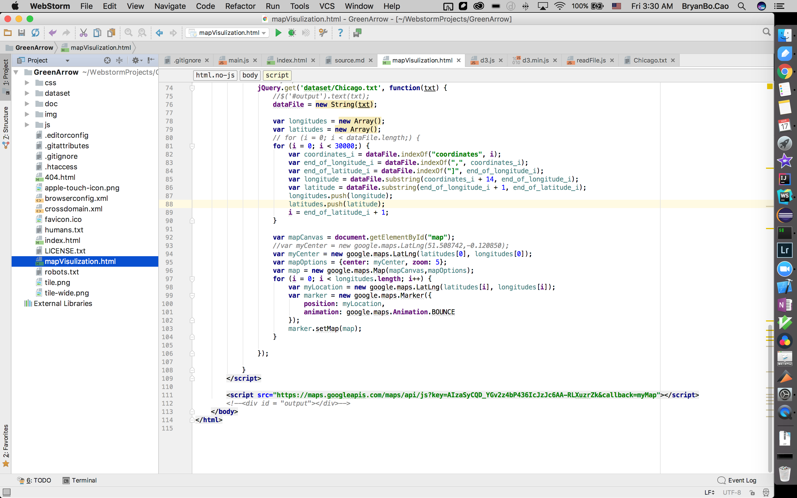

# ATLS-5214-BigDataArchitecture
## Team: IceStream
[Team Link](https://docs.google.com/spreadsheets/d/1Gv0jFhpdrLyGMqTjAnCv5wOGW3jQOCt-bI6XhQpgD9I/edit)
## Project Description
This project aims at using Big Data technologies to build an interactive website displaying crime map. Users would be able to see crime data in a specific city. A crime dataset from government is used. Tech stack will be shown below.

## Team members:
Name | Github Account | Email | Grad/Undergrad
--- | --- | --- | ---
Bryan Bo Cao (Leader) |	BryanBo-Cao	| bo.cao-1@colorado.edu | CS Grad
Chih-Wei Lin | chihweil5 | Chih.W.Lin@colorado.edu | CS Grad
Peilun Zhang | pezhin	| peilun.zhang@colorado.edu | CS Undergrad																	
Yan Li | YanLi26 | yali2241@colorado.edu| CS Grad
Yi-Chen Kuo |	emiliemili0208 | yiku2564@colorado.edu | CS Grad

## APIs:
Google Maps
https://blog.gtwang.org/programming/getting-started-google-maps-javascript-api/

## Quick run:
### Download Webstorm: https://www.jetbrains.com/webstorm/
### Use education account to register
Open project on WebStorm and Run "mapVisualization.html":
Edit Configurations

Name: mapVisulization.html
URL: http://localhost:63342/GreenArrow/mapVisulization.html

Run

